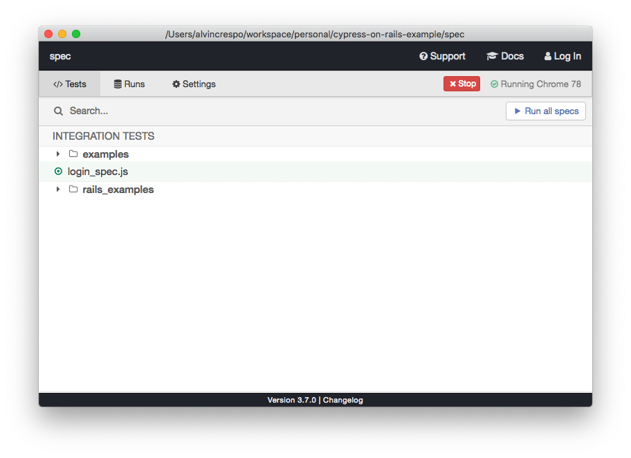

# Rails + Cypress

Modern end to end testing using Cypress.

## Purpose

to teach you how to leverage Cypress to create solid end to end tests that increase your confidence in your development updates.

## Installation

### Install ruby

```
rbenv install 2.6.5
```

Note: Not using [rbenv](https://github.com/rbenv/rbenv)? What are you doing?

### Install bundler

```
gem install bundler 2.0.2
```

### Install frontend deps

```
yarn
```

Note: Not using [yarn](https://yarnpkg.com/lang/en/)? What are you doing?

### Start PostgreSQL

```
pg_ctl -D /usr/local/var/postgres start
```

### Create your db

```
bundle exec rails db:create
```

### Migrate your db

```
bundle exec rails db:migrate
```

You'll most likely need to run the migration for your test environment as well:

```
RAILS_ENV=test bundle exec rails db:migrate
```

## Running the application

```
bundle exec rails s
```

w00t! Visit your app at [http://localhost:3000](http://localhost:3000) 🎉🎉🎉

## Running Tests

1. Open a new window in your terminal and run:

```
bundle exec rails s -e test -p 5002
```

2. Open a new window in your terminal and run:

```
yarn test:open
```

This will open a nice window for you:



Click on the test you want to run, and boom - you're good to go! 🎆🎆🎆
